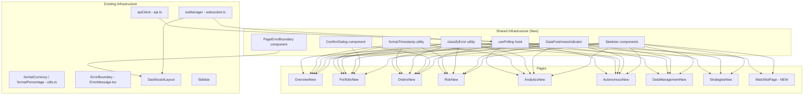

# Design Document: Frontend Trading Overhaul

## Overview

This design covers a comprehensive frontend overhaul of the AlphaCent trading platform. The platform is a React 18 / TypeScript / Vite SPA with Tailwind CSS, Radix UI, Recharts, TanStack Table, Framer Motion, Sonner toasts, Axios, and date-fns. It manages ~$415K in eToro DEMO capital across 117 symbols.

The overhaul addresses 27 requirements spanning: data integrity bugs (hardcoded values, mock data fallbacks, incorrect metric mappings), missing real-time capabilities (polling, P&L ticker, regime notifications), UX deficiencies (loading states, error messages, confirmation dialogs), new features (Watchlist, strategy comparison, manual orders, execution quality), and cross-cutting polish (formatting, timestamps, freshness indicators).

The design is structured to minimize task count by grouping related changes into 7 cohesive implementation tasks sharing a common infrastructure layer.

## Architecture

The overhaul follows the existing architecture: page components fetch data via `apiClient` (REST) and `wsManager` (WebSocket), with shared state in React contexts. No new state management library is introduced.



### Task Grouping Strategy

| Task | Scope | Requirements |
|------|-------|-------------|
| 1. Shared Infrastructure | Hooks, utilities, shared components | 3, 7, 8, 11, 12, 27 (foundations) |
| 2. Risk Page Fixes | RiskNew.tsx only | 1, 2 |
| 3. Dashboard/Header/Layout | App.tsx, DashboardLayout, Sidebar, OverviewNew | 4, 5, 14, 17, 20 |
| 4. Portfolio Page Fixes | PortfolioNew.tsx | 6, 13, 26 |
| 5. Autonomous/Pipeline/Data | AutonomousNew, TradingCyclePipeline, DataManagementNew | 21, 22, 23, 24 |
| 6. Cross-Cutting Polish | All pages — integrate shared infra | 3, 7, 8, 9, 10, 11, 12, 25, 27 (integration) |
| 7. New Pages/Features | WatchlistPage, strategy comparison, manual orders, execution quality | 15, 16, 18, 19 |

## Components and Interfaces

### 1. `usePolling` Hook (Req 3)

A reusable hook that wraps `setInterval` with visibility-aware pausing and WebSocket reconnection triggers.

```typescript
// frontend/src/hooks/usePolling.ts
interface UsePollingOptions {
  /** Fetch function to call on each interval */
  fetchFn: () => Promise<void>;
  /** Polling interval in milliseconds */
  intervalMs: number;
  /** Whether polling is enabled (e.g., page is mounted, tradingMode is set) */
  enabled?: boolean;
  /** Whether to fetch immediately on mount */
  fetchOnMount?: boolean;
}

interface UsePollingReturn {
  /** Manually trigger an immediate fetch */
  refresh: () => Promise<void>;
  /** Whether a fetch is currently in progress */
  isRefreshing: boolean;
}

function usePolling(options: UsePollingOptions): UsePollingReturn;
```

Implementation details:
- Uses `document.addEventListener('visibilitychange', ...)` to pause/resume
- On tab becoming visible, immediately calls `fetchFn` then restarts interval
- Subscribes to `wsManager.onConnectionStateChange` — on reconnect (false→true), immediately calls `fetchFn`
- Cleans up interval and listeners on unmount
- Guards against concurrent fetches with a `useRef` flag

### 2. `formatTimestamp` Utility (Req 7)

```typescript
// frontend/src/lib/utils.ts (added to existing file)
function formatTimestamp(
  dateInput: string | Date,
  options?: { includeTime?: boolean; includeSeconds?: boolean }
): string;
// Returns e.g. "Jan 15, 2026 14:30 EST" or "Jan 15, 2026 EST"
```

Uses `Intl.DateTimeFormat` with `timeZoneName: 'short'` to get the browser's local timezone abbreviation. No new dependencies needed.

### 3. `classifyError` Utility (Req 12)

```typescript
// frontend/src/lib/errors.ts
interface ClassifiedError {
  title: string;       // e.g. "Failed to load positions"
  message: string;     // e.g. "Network error — check your connection"
  isNetwork: boolean;
  isServer: boolean;
  isAuth: boolean;
  retryable: boolean;
}

function classifyError(error: unknown, dataName: string): ClassifiedError;
```

Inspects `AxiosError` properties: no response → network error, 5xx → server error, 401/403 → auth error. Produces user-friendly messages with the `dataName` context.

### 4. `DataFreshnessIndicator` Component (Req 27)

```typescript
// frontend/src/components/ui/DataFreshnessIndicator.tsx
interface DataFreshnessIndicatorProps {
  lastFetchedAt: Date | null;
}
```

Renders "Data as of: [timestamp]" with color logic: green (<2min), amber (2-5min), red (>5min, shows "Stale data"). Uses `useEffect` with a 10-second interval to re-evaluate staleness.

### 5. `ConfirmDialog` Component (Req 13)

```typescript
// frontend/src/components/ui/ConfirmDialog.tsx
interface ConfirmDialogProps {
  open: boolean;
  onOpenChange: (open: boolean) => void;
  title: string;
  description: string;
  confirmLabel?: string;       // default "Confirm"
  confirmVariant?: 'destructive' | 'default';
  onConfirm: () => void | Promise<void>;
  children?: React.ReactNode;  // additional content (e.g., position details)
}
```

Built on the existing Radix `Dialog` component (`frontend/src/components/ui/dialog.tsx`). Adds a loading state on the confirm button while `onConfirm` is executing.

### 6. `PageErrorBoundary` Component (Req 14)

```typescript
// frontend/src/components/PageErrorBoundary.tsx
interface PageErrorBoundaryProps {
  pageName: string;
  children: React.ReactNode;
}
```

Wraps the existing `ErrorBoundary` class component with a page-specific fallback that shows the page name, error message, and a "Reload Page" button (calls `window.location.reload()`). Used in `App.tsx` to wrap each `<Route>` element individually, inside the `<DashboardLayout>` so sidebar/header remain functional.

### 7. `WatchlistPage` Component (Req 15)

```typescript
// frontend/src/pages/WatchlistPage.tsx
```

New page with a `DataTable` (TanStack Table) showing symbols from the trading universe. Columns: symbol, price, daily change ($), daily change (%), volume. Filters: asset class dropdown, text search. Uses `usePolling` at 30s and `wsManager.onMarketData` for real-time updates. Added to `App.tsx` routes and `Sidebar` nav items.

### 8. Strategy Comparison View (Req 16)

Added to `StrategiesNew.tsx` as a comparison mode. Two-strategy selection via checkboxes, then a side-by-side card layout comparing: total return, Sharpe ratio, max drawdown, win rate, total trades, allocation %. Better metric highlighted in green, worse in red.

### 9. Manual Order Form (Req 18)

Added to `OrdersNew.tsx` as a dialog triggered by "New Order" button. Uses existing Radix `Dialog`, `Select`, `Input` components. Fields: symbol (searchable), side, order type, quantity, price (conditional on LIMIT). Two-step: fill form → review step → submit. Calls `apiClient.submitOrder()`.

### 10. Execution Quality Tab (Req 19)

Added to `OrdersNew.tsx` as a new tab. Fetches `apiClient.getExecutionQuality()`. Shows aggregate metrics (avg slippage, fill rate, avg fill time), a Recharts bar chart for slippage distribution, and a sortable DataTable for per-order metrics. Shows "Data unavailable" with retry if the endpoint fails.

### 11. Pending Closure / Alert Banners (Req 6)

Added to `PortfolioNew.tsx` at the top of the page, above tabs. Two collapsible banner components:
- `PendingClosureBanner`: amber warning, shows count + summary, click to scroll to position
- `FundamentalAlertBanner`: red alert, shows count + summary, click to scroll to position
Both auto-dismiss when all items are resolved.

## Data Models

No new backend data models are introduced. All changes are frontend-only, consuming existing API responses. Key existing types used:

```typescript
// Existing types from frontend/src/types/index.ts — no changes needed
interface Position { /* ... existing fields ... */ }
interface Order { /* ... existing fields ... */ }
interface Strategy { /* ... existing fields ... */ }
interface AccountInfo { balance: number; equity: number; /* ... */ }
interface RiskParams { /* ... existing fields ... */ }
interface ExecutionQualityData { avg_slippage: number; fill_rate: number; avg_fill_time: number; order_metrics?: Array<{...}>; }
interface FundamentalAlert { /* ... existing fields ... */ }
```

New frontend-only types:

```typescript
// frontend/src/lib/errors.ts
interface ClassifiedError {
  title: string;
  message: string;
  isNetwork: boolean;
  isServer: boolean;
  isAuth: boolean;
  retryable: boolean;
}

// frontend/src/hooks/usePolling.ts
interface UsePollingOptions {
  fetchFn: () => Promise<void>;
  intervalMs: number;
  enabled?: boolean;
  fetchOnMount?: boolean;
}

// Watchlist page — market data rows
interface WatchlistRow {
  symbol: string;
  price: number;
  dailyChange: number;
  dailyChangePct: number;
  volume: number;
  assetClass: string;
}
```


## Correctness Properties

*A property is a characteristic or behavior that should hold true across all valid executions of a system — essentially, a formal statement about what the system should do. Properties serve as the bridge between human-readable specifications and machine-verifiable correctness guarantees.*

### Property 1: Risk metrics use actual account balance

*For any* set of positions with positive values and *for any* positive account balance, the position size percentage for each position should equal `(positionValue / accountBalance) * 100`, the portfolio exposure percentage should equal `(totalExposure / accountBalance) * 100`, and the risk status calculation should use the provided account balance (not 100000).

**Validates: Requirements 1.1, 1.2, 1.3**

### Property 2: usePolling calls fetchFn at the configured interval

*For any* positive interval value and an enabled polling configuration, after the interval elapses (simulated via fake timers), the fetchFn should have been called exactly once per interval tick, and the total call count after N ticks should equal N (plus 1 if fetchOnMount is true).

**Validates: Requirements 3.1, 3.2, 3.3, 3.4, 3.5, 3.6**

### Property 3: usePolling pauses when hidden and resumes with immediate fetch when visible

*For any* active polling configuration, when `document.hidden` becomes true, no further fetchFn calls should occur during subsequent interval ticks. When `document.hidden` becomes false again, fetchFn should be called immediately (within the same tick) and periodic polling should resume.

**Validates: Requirements 3.7, 3.8**

### Property 4: usePolling fetches immediately on WebSocket reconnection

*For any* active polling configuration, when a WebSocket reconnection event fires (connection state transitions from false to true), fetchFn should be called immediately regardless of where the current interval stands.

**Validates: Requirements 3.9**

### Property 5: formatTimestamp always includes a timezone abbreviation

*For any* valid date string or Date object, `formatTimestamp(input)` should produce a string that contains a recognized timezone abbreviation (matching the pattern of 2-5 uppercase letters like "EST", "UTC", "PDT", "CEST", or a GMT offset).

**Validates: Requirements 7.1, 7.2, 7.3, 7.4, 7.5**

### Property 6: classifyError produces contextual error messages

*For any* error object and *for any* data name string, `classifyError(error, dataName)` should produce a `ClassifiedError` where: (a) the title contains the dataName, (b) if the error has no response, `isNetwork` is true and the message mentions connectivity, (c) if the error has a 5xx status, `isServer` is true, (d) `retryable` is true for network and server errors.

**Validates: Requirements 12.1, 12.2, 12.3**

### Property 7: DataFreshnessIndicator shows correct staleness level

*For any* `lastFetchedAt` timestamp and *for any* current time, the DataFreshnessIndicator should: (a) show green styling when the age is under 2 minutes, (b) show amber styling when the age is between 2 and 5 minutes, (c) show red styling and contain "Stale" text when the age exceeds 5 minutes. The rendered text should always contain a formatted version of the timestamp.

**Validates: Requirements 27.1, 27.2, 27.3**

### Property 8: Pending closure and alert banners reflect list state

*For any* non-empty array of pending closures, the PendingClosureBanner should be visible and display the correct count. *For any* non-empty array of fundamental alerts, the FundamentalAlertBanner should be visible and display the correct count. *For any* empty array, the corresponding banner should not be rendered.

**Validates: Requirements 6.1, 6.2, 6.4, 6.5**

### Property 9: P&L color matches sign

*For any* numeric P&L value, the color class returned should be green (accent-green) when the value is positive, red (accent-red) when negative, and neutral (gray) when zero.

**Validates: Requirements 5.3**

### Property 10: Cycle pipeline metric mapping reads from correct stages

*For any* stage metrics object (a record mapping stage keys to their metrics), the metric extraction should: read `retired` from `cleanup_retirement`, read `signals_generated` from `signal_generation`, read `orders_submitted` from `order_submission`, map `approved` to display label "Activated", read `total_active` from `strategy_activation`, and display "—" for any null or undefined metric value.

**Validates: Requirements 21.1, 21.2, 21.3, 21.4, 21.5, 21.6**

### Property 11: Watchlist filtering returns correct subset

*For any* list of WatchlistRow items, *for any* asset class filter value, the filtered result should only contain rows matching that asset class. *For any* search string, the filtered result should only contain rows whose symbol includes the search string (case-insensitive). When both filters are applied, both conditions must hold for every returned row.

**Validates: Requirements 15.3, 15.4**

### Property 12: Strategy comparison highlights the better metric

*For any* two strategies with numeric metric values, the comparison view should highlight the strategy with the higher value in green for metrics where higher is better (total return, Sharpe ratio, win rate) and the strategy with the lower value in green for metrics where lower is better (max drawdown).

**Validates: Requirements 16.2, 16.3**

### Property 13: Order form validation rejects invalid inputs

*For any* order form input where symbol is empty, or quantity is zero or negative, or order type is LIMIT and price is missing/zero/negative, the validation function should return an error. *For any* valid input (non-empty symbol, positive quantity, and price present for LIMIT orders), validation should pass.

**Validates: Requirements 18.4**

### Property 14: Stale symbol detection and warning threshold

*For any* set of symbols with last-updated timestamps, a symbol should be flagged as stale if its hourly data is older than 2 hours or its daily data is older than 1 day. The warning banner should be visible if and only if the stale count exceeds 10% of total symbols.

**Validates: Requirements 23.2, 23.4**

### Property 15: Last cycle metrics sourced from cycle history

*For any* non-empty cycle history array (sorted by recency), the "Last Cycle" metrics should equal the values from the first entry: duration, proposals_generated, backtest pass rate (backtest_passed / backtested), and net activations (activated - strategies_retired).

**Validates: Requirements 24.3, 24.4**

### Property 16: Closed positions win rate calculation

*For any* array of closed positions where each has a realized_pnl value, the win rate should equal the count of positions with realized_pnl > 0 divided by the total count, expressed as a percentage.

**Validates: Requirements 26.3**

### Property 17: Regime change detection across values

*For any* two different regime strings (previous and current), the regime change notification should contain both the previous regime name and the new regime name. When the previous and current regime are the same, no notification should be produced.

**Validates: Requirements 17.1, 17.3**

### Property 18: Bulk close confirmation lists all selected positions

*For any* non-empty set of selected positions, the confirmation dialog content should include every selected position's symbol and the total P&L impact should equal the sum of all selected positions' unrealized_pnl values.

**Validates: Requirements 13.3**

### Property 19: PageErrorBoundary shows page-specific error

*For any* page name string and *for any* Error object, the PageErrorBoundary fallback should render text containing the page name and a "Reload" button.

**Validates: Requirements 14.2**

### Property 20: Analytics tab cache invalidation after 5 minutes

*For any* cached data entry with a timestamp older than 5 minutes, when the corresponding tab becomes active, a re-fetch should be triggered. For cached data younger than 5 minutes, no re-fetch should occur on tab activation.

**Validates: Requirements 10.4**

## Error Handling

### Error Classification Strategy

All API errors flow through the `classifyError` utility which inspects the Axios error shape:

| Error Type | Detection | User Message | Retryable |
|-----------|-----------|-------------|-----------|
| Network | No `error.response` | "Network error — check your connection" | Yes |
| Server (5xx) | `error.response.status >= 500` | "Server error — the backend encountered a problem" | Yes |
| Auth (401/403) | `error.response.status === 401 or 403` | Redirect to login + toast "Session expired" | No |
| Client (4xx) | `error.response.status >= 400 && < 500` | Show server-provided message | No |
| Unknown | Catch-all | "An unexpected error occurred" | Yes |

### Per-Section Error States

Each page section that fetches data independently gets its own error state:
- Primary data failures (positions, orders, metrics) show the `ErrorState` component with retry button, replacing the section content
- Secondary data failures (pending closures, fundamental alerts, execution quality) show the `InlineError` component within the section, keeping other content visible
- The existing `ErrorBoundary` catches rendering errors; the new `PageErrorBoundary` wraps each route

### Graceful Degradation

- If `usePolling` fetch fails, the existing data remains displayed (no clearing on error)
- If WebSocket disconnects, polling continues as fallback
- If `formatTimestamp` receives an invalid date, it returns the raw input string rather than crashing
- If `classifyError` receives a non-Axios error, it falls back to the generic "unexpected error" classification

## Testing Strategy

### Dual Testing Approach

This feature uses both unit tests and property-based tests for comprehensive coverage:

- **Unit tests** (Vitest): Specific examples, edge cases, integration points, UI rendering
- **Property-based tests** (fast-check via Vitest): Universal properties across generated inputs

### Property-Based Testing Configuration

- Library: `fast-check` (already compatible with Vitest)
- Minimum iterations: 100 per property test
- Each property test must reference its design document property with a tag comment:
  ```typescript
  // Feature: frontend-trading-overhaul, Property 1: Risk metrics use actual account balance
  ```

### Test Organization

```
frontend/src/__tests__/
├── properties/
│   ├── usePolling.property.test.ts       (Properties 2, 3, 4)
│   ├── formatTimestamp.property.test.ts   (Property 5)
│   ├── classifyError.property.test.ts     (Property 6)
│   ├── freshnessIndicator.property.test.ts (Property 7)
│   ├── riskCalculations.property.test.ts  (Property 1)
│   ├── banners.property.test.ts           (Property 8)
│   ├── pnlColor.property.test.ts          (Property 9)
│   ├── pipelineMetrics.property.test.ts   (Property 10)
│   ├── watchlistFilter.property.test.ts   (Property 11)
│   ├── strategyComparison.property.test.ts (Property 12)
│   ├── orderValidation.property.test.ts   (Property 13)
│   ├── staleSymbols.property.test.ts      (Property 14)
│   ├── cycleMetrics.property.test.ts      (Property 15)
│   ├── winRate.property.test.ts           (Property 16)
│   ├── regimeChange.property.test.ts      (Property 17)
│   ├── bulkClose.property.test.ts         (Property 18)
│   ├── pageErrorBoundary.property.test.ts (Property 19)
│   └── tabCache.property.test.ts          (Property 20)
├── unit/
│   ├── RiskNew.test.tsx                   (Req 1, 2 examples + edge cases)
│   ├── DashboardLayout.test.tsx           (Req 5, 20 examples)
│   ├── PortfolioNew.test.tsx              (Req 6, 13, 26 examples)
│   ├── AutonomousNew.test.tsx             (Req 22, 24 examples)
│   ├── OrdersNew.test.tsx                 (Req 18, 19 examples)
│   ├── WatchlistPage.test.tsx             (Req 15 examples)
│   ├── StrategiesNew.test.tsx             (Req 16 examples)
│   └── App.test.tsx                       (Req 4, 14 examples)
```

### What Each Test Type Covers

**Property tests** cover all 20 correctness properties above — each property is implemented by a single `fc.assert(fc.property(...))` call with ≥100 iterations.

**Unit tests** cover:
- Edge cases: null/undefined account balance (Req 1.4), empty position lists, zero-length cycle history
- UI examples: skeleton shown during loading (Req 11), confirmation dialog structure (Req 13.4), tooltip on hover (Req 9.1)
- Integration examples: WS event updates badge (Req 20), regime change toast (Req 17.2), auth redirect (Req 4.2)
- Specific scenarios: mock data functions removed (Req 2.4), Quick Actions card removed (Req 22.2)
