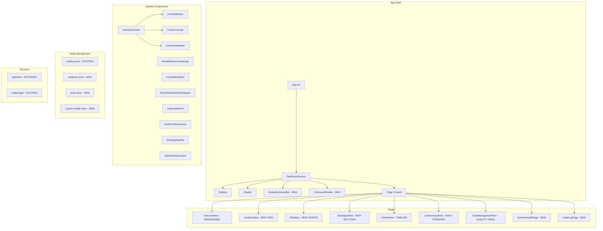

# Design Document: Quant Platform UI Overhaul

## Overview

This design covers the comprehensive UI/UX overhaul of the AlphaCent autonomous trading platform frontend. The overhaul transforms the existing React 19 + Vite 8 + TypeScript application from its current inconsistent layout into an institutional-grade trading dashboard inspired by QuantConnect, Bloomberg Terminal, and pyfolio tear sheets.

The overhaul spans 21 requirements across these domains:
- **Core Visual Overhaul** (Reqs 1-5): SPY benchmark overlay, global summary bar, overview redesign, design system, chart interactivity
- **Page Enhancements** (Reqs 6-9): Page-specific improvements, loading states, responsive layout, real-time WebSocket updates
- **Advanced Analytics** (Reqs 10-13): Rolling statistics, performance attribution, drawdown/return distribution, position-level analytics
- **Power User Features** (Reqs 14-16): Command palette, PDF tear sheet export, multi-timeframe performance
- **Observability & Intelligence** (Reqs 17-21): System health, strategy lifecycle, data pipeline, TCA, audit trail

The existing tech stack is preserved: React 19, Tailwind CSS 4, Radix UI, Recharts 3.7, Zustand 5, Framer Motion 12, react-router-dom 7, @tanstack/react-table 8, axios, sonner, and the custom wsManager for WebSocket.

### Key Design Decisions

1. **Recharts over TradingView Lightweight Charts**: Extend Recharts with custom zoom/pan/crosshair via `recharts` reference areas and custom tooltip components. Avoids adding a new charting dependency and keeps the bundle smaller. TradingView Lightweight Charts would be ideal for candlestick asset plots (Req 13) but the cost of maintaining two chart libraries outweighs the benefit for this phase.

2. **Client-side PDF generation**: Use `html2canvas` + `jspdf` for tear sheet export (Req 15). Server-side generation would require a headless browser on EC2, adding complexity. Client-side keeps the backend unchanged.

3. **New Zustand stores** for new data domains (analytics-store, audit-store, system-health-store) rather than overloading the existing trading-store.

4. **Command Palette via Radix Dialog** (Req 14): A global `<CommandPalette>` component rendered at the App level, triggered by `Ctrl+K`/`Cmd+K`, using fuzzy search via a lightweight `fuse.js` or custom scoring function.

5. **Virtual scrolling for Audit Log** (Req 21): Use `@tanstack/react-virtual` for rendering 10,000+ log entries without DOM bloat.

6. **Global Summary Bar in DashboardLayout**: A new `<GlobalSummaryBar>` component rendered between the header and `<main>` in `DashboardLayout.tsx`, max 48px height, fed by WebSocket events and a lightweight polling fallback.

## Architecture

The overhaul follows the existing architecture pattern: pages consume hooks that call `apiClient` methods, with WebSocket subscriptions for real-time updates. New components are organized by domain.



### New Routes

| Route | Component | Description |
|-------|-----------|-------------|
| `/system-health` | `SystemHealthPage` | System observability dashboard (Req 17) |
| `/audit-log` | `AuditLogPage` | Audit trail and decision log (Req 21) |
| `/portfolio/:symbol` | `PositionDetailView` | Position-level drill-down (Req 13) |

### File Structure (New Files)

```
frontend/src/
├── components/
│   ├── GlobalSummaryBar.tsx          # Persistent metrics bar (Req 2)
│   ├── CommandPalette.tsx            # Ctrl+K navigation (Req 14)
│   ├── charts/
│   │   ├── InteractiveChart.tsx      # Zoom/pan/crosshair wrapper (Req 5)
│   │   ├── PeriodSelector.tsx        # 1W/1M/3M/6M/1Y/ALL buttons
│   │   ├── EquityCurveChart.tsx      # Equity + SPY + alpha (Req 1)
│   │   ├── UnderwaterPlot.tsx        # Drawdown area chart (Req 12)
│   │   ├── MonthlyReturnsHeatmap.tsx # Year×Month grid (Req 12)
│   │   ├── ReturnDistribution.tsx    # Histogram + normal overlay (Req 12)
│   │   ├── CorrelationHeatmap.tsx    # Position correlation (Req 6)
│   │   ├── AssetPlot.tsx            # Price + order annotations (Req 13)
│   │   ├── MultiTimeframeView.tsx   # Compact return cells (Req 16)
│   │   └── OrderFlowTimeline.tsx    # Horizontal event timeline (Req 6)
│   ├── trading/
│   │   └── StrategyPipeline.tsx     # Lifecycle visualization (Req 3)
│   └── pdf/
│       └── TearSheetGenerator.tsx   # PDF export logic (Req 15)
├── pages/
│   ├── SystemHealthPage.tsx         # New page (Req 17)
│   ├── AuditLogPage.tsx             # New page (Req 21)
│   └── PositionDetailView.tsx       # Position drill-down (Req 13)
├── lib/stores/
│   ├── analytics-store.ts           # Rolling stats, attribution, TCA
│   ├── audit-store.ts               # Audit log entries, filters
│   └── system-health-store.ts       # Circuit breakers, services
└── hooks/
    └── useFuzzySearch.ts            # Fuzzy search for command palette
```

## Components and Interfaces

### GlobalSummaryBar (Req 2)

Rendered in `DashboardLayout.tsx` between the header and `<main>`. Fixed 48px height.

```typescript
interface GlobalSummaryBarProps {}

// Displays: Total Equity, Daily P&L ($, %), Open Positions, Active Strategies,
// Market Regime, System Health score
// Conditionally shows Multi-Timeframe condensed view at viewport > 1440px (Req 16.5)
// Conditionally shows data health indicator at viewport > 1440px (Req 19.7)
// Yellow warning indicator when WebSocket disconnected (Req 2.5)
```

Data source: Combines existing `apiClient.getAccountInfo()`, `apiClient.getDashboardSummary()`, and WebSocket position/order events. Polls every 30s as fallback.

### InteractiveChart (Req 5)

Wraps Recharts `ResponsiveContainer` with zoom, pan, and crosshair capabilities.

```typescript
interface InteractiveChartProps {
  data: Array<Record<string, any>>;
  dataKeys: Array<{ key: string; color: string; type: 'line' | 'area' | 'bar' }>;
  xAxisKey: string;
  periods?: ('1W' | '1M' | '3M' | '6M' | '1Y' | 'ALL')[];
  defaultPeriod?: string;
  onPeriodChange?: (period: string) => void;
  height?: number;
  showCrosshair?: boolean;
  showZoom?: boolean;
  tooltipFormatter?: (value: any, name: string) => [string, string];
  children?: React.ReactNode; // For custom reference areas, lines, etc.
}
```

Implementation approach:
- **Zoom**: Track `refAreaLeft`/`refAreaRight` state via mouse drag on the chart. On release, filter data to the selected x-range. Recharts `ReferenceArea` for visual selection.
- **Pan**: When zoomed, track mouse drag to shift the visible window left/right.
- **Crosshair**: Custom `<Tooltip>` with `cursor={{ stroke: '#9ca3af' }}` and a vertical `ReferenceLine` following the active tooltip index.
- **Period Selector**: `<PeriodSelector>` component above the chart that filters data by date range and calls `onPeriodChange`.

### EquityCurveChart (Req 1)

```typescript
interface EquityCurveChartProps {
  equityData: Array<{ date: string; portfolio: number; spy: number }>;
  period: string;
  onPeriodChange: (period: string) => void;
}
```

Renders two `<Line>` series (portfolio blue, SPY gray dashed) normalized to 100 at period start. Alpha shaded area between lines using `<Area>` with conditional fill (green when portfolio > SPY, red otherwise). Synchronized drawdown sub-chart below sharing the same x-axis domain.

### CommandPalette (Req 14)

```typescript
interface CommandPaletteProps {
  isOpen: boolean;
  onClose: () => void;
}

interface SearchableItem {
  id: string;
  type: 'symbol' | 'strategy' | 'page' | 'action';
  label: string;
  description?: string;
  action: () => void;
}
```

Rendered at App level inside a Radix `Dialog`. Fuzzy search across symbols (from positions + watchlist), strategies, pages, and actions. Results grouped by category. Keyboard navigation with arrow keys + Enter. Recent items stored in `localStorage`.

### TearSheetGenerator (Req 15)

```typescript
interface TearSheetConfig {
  period: '1M' | '3M' | '6M' | '1Y' | 'ALL';
  includeEquityCurve: boolean;
  includeMonthlyReturns: boolean;
  includeDrawdown: boolean;
  includeSectorExposure: boolean;
  includeTopPerformers: boolean;
}
```

Uses `html2canvas` to capture chart DOM elements as images, then `jspdf` to compose a multi-page PDF with header (logo, title, date, period), statistics table, charts, and footer. Progress tracked via state for the UI indicator.

### SystemHealthPage (Req 17)

New page at `/system-health`. Displays:
- Circuit breaker states (3 categories) with color indicators
- Monitoring service sub-task status with last cycle timestamps
- Trading scheduler status
- eToro API health metrics
- Background thread status
- Cache statistics
- 24-hour event timeline
- WebSocket-driven real-time updates

Data source: New `apiClient.getSystemHealth()` endpoint (or compose from existing `getServicesStatus()`, `getMonitoringStatus()`).

### AuditLogPage (Req 21)

New page at `/audit-log`. Features:
- Chronological log table with virtual scrolling (`@tanstack/react-virtual`)
- Multi-filter: event type, symbol, strategy, severity, date range
- Full-text search with debounced input (200ms target)
- Trade lifecycle detail view (expandable row or modal)
- Signal rejections summary section
- Strategy lifecycle events section
- Risk limit events section
- CSV export of filtered entries

Data source: New `apiClient.getAuditLog()` endpoint with server-side filtering and pagination.

## Data Models

### New API Endpoints Required

```typescript
// System Health (Req 17)
apiClient.getSystemHealth(): Promise<SystemHealthData>

// Audit Log (Req 21)
apiClient.getAuditLog(filters: AuditLogFilters): Promise<AuditLogResponse>
apiClient.getTradeLifecycle(tradeId: string): Promise<TradeLifecycleData>
apiClient.exportAuditLog(filters: AuditLogFilters): Promise<Blob>

// Rolling Statistics (Req 10)
apiClient.getRollingStatistics(mode: TradingMode, period: string, window: number): Promise<RollingStatsData>

// Performance Attribution (Req 11)
apiClient.getPerformanceAttribution(mode: TradingMode, period: string, groupBy: 'sector' | 'asset_class'): Promise<AttributionData>

// Tear Sheet Data (Req 12)
apiClient.getTearSheetData(mode: TradingMode, period: string): Promise<TearSheetData>

// Position Detail (Req 13)
apiClient.getPositionDetail(symbol: string, mode: TradingMode): Promise<PositionDetailData>

// TCA (Req 20)
apiClient.getTCAData(mode: TradingMode, period: string): Promise<TCAData>

// Template Rankings (Req 18)
apiClient.getTemplateRankings(mode: TradingMode): Promise<TemplateRankingData[]>

// Walk-Forward Analytics (Req 18)
apiClient.getWalkForwardAnalytics(mode: TradingMode, period: string): Promise<WalkForwardData>

// Data Quality (Req 19)
apiClient.getDataQuality(): Promise<DataQualityData[]>
```

### Key TypeScript Interfaces

```typescript
interface SystemHealthData {
  circuit_breakers: Array<{
    category: 'orders' | 'positions' | 'market_data';
    state: 'CLOSED' | 'OPEN' | 'HALF_OPEN';
    failure_count: number;
    cooldown_remaining_seconds: number;
  }>;
  monitoring_service: {
    running: boolean;
    sub_tasks: Array<{
      name: string;
      last_cycle: string;
      status: 'healthy' | 'stale' | 'error';
      interval_seconds: number;
    }>;
  };
  trading_scheduler: {
    last_signal_time: string;
    next_expected_run: string;
    signals_last_run: number;
    orders_last_run: number;
  };
  etoro_api: {
    requests_per_minute: number;
    error_rate_5m: number;
    avg_response_ms: number;
    rate_limit_remaining: number;
  };
  cache_stats: {
    order_cache_hit_rate: number;
    position_cache_hit_rate: number;
    historical_cache_hit_rate: number;
    fmp_cache_warm_status: {
      last_warm_time: string;
      symbols_from_api: number;
      symbols_from_cache: number;
    };
  };
  events_24h: Array<{
    timestamp: string;
    type: string;
    description: string;
    severity: 'info' | 'warning' | 'error';
  }>;
}

interface RollingStatsData {
  rolling_sharpe: Array<{ date: string; value: number }>;
  rolling_beta: Array<{ date: string; value: number }>;
  rolling_alpha: Array<{ date: string; value: number }>;
  rolling_volatility: Array<{ date: string; value: number }>;
  probabilistic_sharpe: number;
  information_ratio: number;
  treynor_ratio: number;
  tracking_error: number;
}

interface AttributionData {
  sectors: Array<{
    sector: string;
    portfolio_weight: number;
    benchmark_weight: number;
    portfolio_return: number;
    benchmark_return: number;
    allocation_effect: number;
    selection_effect: number;
    interaction_effect: number;
    total_contribution: number;
  }>;
  cumulative_effects: Array<{
    date: string;
    allocation: number;
    selection: number;
    interaction: number;
  }>;
}

interface TearSheetData {
  underwater_plot: Array<{ date: string; drawdown_pct: number }>;
  worst_drawdowns: Array<{
    rank: number;
    start_date: string;
    trough_date: string;
    recovery_date: string | null;
    depth_pct: number;
    duration_days: number;
    recovery_days: number | null;
  }>;
  return_distribution: Array<{ bin: number; count: number }>;
  skew: number;
  kurtosis: number;
  annual_returns: Array<{ year: number; return_pct: number }>;
  monthly_returns: Array<{ year: number; month: number; return_pct: number }>;
}

interface TCAData {
  slippage_by_symbol: Array<{ symbol: string; avg_slippage_pct: number; trade_count: number }>;
  slippage_by_hour: Array<{ hour: number; day: string; avg_slippage: number }>;
  slippage_by_size: Array<{ bucket: string; avg_slippage: number; trade_count: number }>;
  implementation_shortfall: Array<{
    symbol: string;
    expected_price: number;
    fill_price: number;
    market_close_price: number;
    shortfall_dollars: number;
    shortfall_bps: number;
    trade_date: string;
  }>;
  total_shortfall_dollars: number;
  total_shortfall_bps: number;
  fill_rate_buckets: Array<{ within_seconds: number; percentage: number }>;
  cost_as_pct_of_alpha: number;
  execution_quality_trend: Array<{ date: string; avg_slippage: number }>;
  per_asset_class: Array<{
    asset_class: string;
    avg_slippage: number;
    avg_shortfall_bps: number;
    trade_count: number;
  }>;
  worst_executions: Array<{
    symbol: string;
    expected_price: number;
    fill_price: number;
    slippage_pct: number;
    timestamp: string;
    order_size_dollars: number;
    asset_class: string;
  }>;
}

interface AuditLogEntry {
  id: string;
  timestamp: string;
  event_type: string;
  symbol?: string;
  strategy_name?: string;
  severity: 'info' | 'warning' | 'error';
  description: string;
  metadata?: Record<string, any>;
}

interface AuditLogFilters {
  event_types?: string[];
  symbol?: string;
  strategy_name?: string;
  severity?: string;
  start_date?: string;
  end_date?: string;
  search?: string;
  offset?: number;
  limit?: number;
}

interface TradeLifecycleData {
  signal: { timestamp: string; conviction_score: number; signal_strength: number; indicators: Record<string, number> };
  risk_validation: { timestamp: string; position_size: number; checks_passed: string[]; checks_failed: string[] };
  order: { timestamp: string; expected_price: number; type: string; quantity: number };
  fill: { timestamp: string; fill_price: number; slippage: number };
  position: { opened_at: string; stop_loss: number; take_profit: number };
  trailing_stops: Array<{ timestamp: string; old_level: number; new_level: number }>;
  close: { timestamp: string; exit_reason: string; final_pnl: number; final_pnl_pct: number } | null;
}

interface DataQualityEntry {
  symbol: string;
  asset_class: string;
  quality_score: number;
  last_price_update: string;
  data_source: 'yahoo' | 'fmp' | 'etoro';
  active_issues: number;
  staleness_seconds: number;
}
```

### New Dependencies

| Package | Purpose | Size |
|---------|---------|------|
| `html2canvas` | DOM-to-canvas for PDF charts | ~40KB |
| `jspdf` | PDF document generation | ~280KB |
| `@tanstack/react-virtual` | Virtual scrolling for audit log | ~10KB |
| `fuse.js` | Fuzzy search for command palette | ~15KB |


## Error Handling

### Data Fetching Errors

All new API calls follow the existing pattern established in the codebase:

1. **Retry with backoff**: `apiClient.withRetry()` handles transient failures (3 retries, exponential backoff). 4xx errors (except 429) are not retried.
2. **Error classification**: `classifyError()` from `lib/errors.ts` categorizes errors as network, auth, server, or client errors with user-friendly messages.
3. **Graceful degradation**: Each section/tab loads independently. If rolling statistics fail, the rest of the Analytics page still renders. Error states show retry buttons.
4. **Skeleton loaders** (Req 7): Every page shows `<PageSkeleton>` during initial load. Individual sections show `<SkeletonLoader>` matching content shape. Transition to content with 200ms fade-in.
5. **Timeout handling**: 10-second timeout for data fetching. On timeout, replace skeleton with error state + retry button (Req 7.5).

### WebSocket Disconnection (Req 9)

- `GlobalSummaryBar` shows yellow warning indicator when `wsConnected === false` (Req 2.5)
- Dashboard falls back to REST polling at 30s intervals (Req 9.4)
- On reconnect, full data refresh to synchronize state (Req 9.5)
- System Health page shows reconnection indicator (Req 17.11)

### PDF Generation Errors (Req 15)

- Progress indicator during generation (Req 15.4)
- If `html2canvas` fails on a chart section, skip that section and offer partial report (Req 15.6)
- Error message specifies which sections are unavailable

### Insufficient Data Handling

Multiple requirements specify behavior when data is insufficient:
- Rolling statistics: "minimum N trading days required" message (Req 10.8)
- Performance attribution: "minimum N closed trades required" message (Req 11.7)
- Multi-timeframe: "N/A" with muted style for unavailable periods (Req 16.6)
- TCA: "minimum 10 closed trades required" message (Req 20.13)
- Template rankings: "No data" with muted style (Req 18.10)
- Data quality: "Pending" with muted style (Req 19.10)
- Audit log: "No audit records exist" message (Req 21.11)
- SPY benchmark: "Benchmark unavailable" badge (Req 1.6)
- Asset plot: "Order history unavailable" badge (Req 13.7)

### Responsive Error States

On mobile viewports (< 768px), error messages are condensed. Retry buttons remain accessible. Error banners stack vertically.

## Testing Strategy

### Why Property-Based Testing Does Not Apply

This feature is a comprehensive UI/UX overhaul consisting of:
- React component rendering and layout
- Chart visualization and interactivity
- Responsive CSS/Tailwind behavior
- PDF document generation
- WebSocket event handling and display
- Data table filtering, sorting, and pagination

These are UI rendering, layout, and data display concerns. There are no pure functions with universal properties that hold across a wide input space. The acceptance criteria describe visual behavior, component composition, and user interactions — not algorithmic transformations amenable to property-based testing.

**Appropriate testing strategies for this feature:**
- Snapshot tests for component rendering
- Example-based unit tests for data formatting and filtering logic
- Integration tests for API call → state update → render cycles
- Visual regression tests for layout consistency
- E2E tests for critical user flows (command palette, PDF export, navigation)

### Unit Tests

Focus on utility functions and data transformation logic that support the UI:

| Test Area | Examples |
|-----------|----------|
| Equity normalization | Normalize portfolio + SPY to 100 at period start |
| Alpha calculation | Portfolio return minus SPY return at each date |
| Period filtering | Filter time-series data by 1W/1M/3M/6M/1Y/ALL |
| Fuzzy search scoring | Command palette search ranking |
| Monthly returns grid | Transform daily returns into year×month matrix |
| Return distribution binning | Bin daily returns into histogram buckets |
| Drawdown calculation | Compute underwater plot from equity curve |
| Color coding logic | Green/red/yellow thresholds for metrics |
| Responsive breakpoints | Metric grid column count at different widths |
| CSV export formatting | Audit log entries to CSV string |
| PDF filename generation | `AlphaCent_TearSheet_{period}_{date}.pdf` format |

### Integration Tests

| Test Area | What's Verified |
|-----------|-----------------|
| GlobalSummaryBar | Renders correct metrics, updates on WS events, shows warning on disconnect |
| InteractiveChart | Period selector filters data, zoom/pan state management |
| CommandPalette | Opens on Ctrl+K, fuzzy search returns results, keyboard navigation works |
| EquityCurveChart | Renders both lines, crosshair shows alpha, period change re-normalizes |
| SystemHealthPage | Displays circuit breaker states, updates via WebSocket |
| AuditLogPage | Filters work, search returns results, pagination loads more entries |
| TCA tab | Period selector recalculates all metrics |
| PDF export | Generates downloadable file with correct filename |

### Snapshot Tests

Capture rendered output of key components to detect unintended visual regressions:
- `GlobalSummaryBar` in connected/disconnected states
- `MetricCard` with positive/negative/zero values
- `PeriodSelector` with each period active
- `MonthlyReturnsHeatmap` with sample data
- `CorrelationHeatmap` with sample matrix
- `StrategyPipeline` with various stage counts

### E2E Tests (Manual or Playwright)

Critical user flows:
1. Navigate to Overview → verify equity curve with SPY overlay renders
2. Press Ctrl+K → type symbol → navigate to position detail
3. Analytics → Rolling Statistics tab → change window size → verify chart updates
4. Analytics → Tear Sheet tab → verify all visualizations render
5. Click "Download Tear Sheet" → verify PDF downloads
6. Navigate to Audit Log → filter by event type → search → verify results
7. Resize viewport to mobile → verify responsive layout changes
8. Disconnect WebSocket → verify fallback polling and warning indicators

### Test Configuration

- Test runner: Vitest (already configured in `package.json`)
- Component testing: `@testing-library/react` with `vitest`
- Snapshot testing: Vitest inline snapshots
- E2E: Playwright (recommended for future addition)
- Run command: `vitest --run` (single execution, no watch mode)
