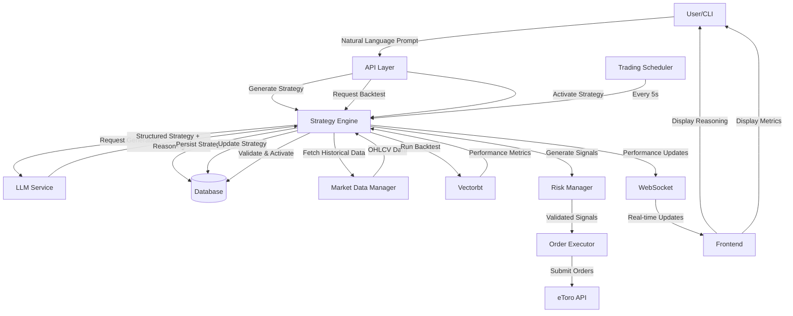

# Design Document: Strategy Generation and Activation

## Overview

This feature enables the AlphaCent trading platform to transition from an idle state to active autonomous trading by providing a complete workflow for generating, validating, activating, and monitoring trading strategies. The system leverages an LLM (Ollama) to translate natural language prompts into structured strategy definitions, validates them through historical backtesting using vectorbt, and activates them for autonomous execution via the existing trading scheduler.

The design focuses on three key workflows:

1. **Strategy Generation**: Natural language → LLM reasoning → Structured strategy definition
2. **Strategy Validation**: Historical backtesting → Performance metrics → Activation eligibility
3. **Strategy Execution**: Autonomous signal generation → Risk validation → Order execution → Performance monitoring

A critical UX enhancement is the visualization of the LLM's reasoning process, showing users the hypothesis, alpha sources, signal logic, and confidence scores behind each strategy.

## Architecture

### High-Level Component Interaction



### Data Flow

1. **Strategy Creation Flow**:
   - User submits natural language prompt via API or CLI
   - LLM Service generates structured strategy with reasoning metadata
   - Strategy Engine validates and persists strategy (status: PROPOSED)
   - Frontend displays strategy with LLM reasoning visualization

2. **Backtesting Flow**:
   - User requests backtest for PROPOSED strategy
   - Strategy Engine fetches historical data from Market Data Manager
   - Vectorbt executes backtest simulation
   - Performance metrics calculated and persisted (status: BACKTESTED)
   - Frontend displays backtest results with equity curve

3. **Activation Flow**:
   - User activates BACKTESTED strategy in DEMO or LIVE mode
   - Strategy Engine validates allocation constraints
   - Strategy status updated to DEMO or LIVE
   - Trading Scheduler begins generating signals for active strategy

4. **Autonomous Trading Flow**:
   - Trading Scheduler runs every 5 seconds
   - Strategy Engine generates signals for all active strategies
   - Risk Manager validates signals against risk parameters
   - Order Executor submits validated orders to eToro API
   - Performance metrics updated and broadcast via WebSocket

## Components and Interfaces

### 1. Strategy Engine (Enhanced)

**Responsibilities**:
- Generate strategies via LLM Service
- Backtest strategies using vectorbt
- Activate/deactivate strategies
- Generate trading signals for active strategies
- Monitor and update performance metrics
- Capture and store LLM reasoning metadata

**Key Methods**:

```python
def generate_strategy(
    self,
    prompt: str,
    constraints: Dict[str, Any]
) -> Strategy:
    """
    Generate strategy from natural language prompt.
    
    Args:
        prompt: Natural language description
        constraints: Market context and risk parameters
    
    Returns:
        Strategy with PROPOSED status and reasoning metadata
    """

def backtest_strategy(
    self,
    strategy: Strategy,
    start: datetime,
    end: datetime
) -> BacktestResults:
    """
    Backtest strategy using historical data.
    
    Args:
        strategy: Strategy to backtest
        start: Start date for backtest period
        end: End date for backtest period
    
    Returns:
        BacktestResults with performance metrics
    
    Raises:
        ValueError: If strategy not PROPOSED or data unavailable
    """

def activate_strategy(
    self,
    strategy_id: str,
    mode: TradingMode
) -> None:
    """
    Activate strategy for autonomous trading.
    
    Args:
        strategy_id: Strategy identifier
        mode: DEMO or LIVE trading mode
    
    Raises:
        ValueError: If strategy not BACKTESTED or allocation exceeds 100%
    """

def generate_signals(
    self,
    strategy: Strategy
) -> List[TradingSignal]:
    """
    Generate trading signals for active strategy.
    
    Args:
        strategy: Active strategy
    
    Returns:
        List of trading signals with confidence scores
    """
```

### 2. LLM Service (Enhanced)

**Responsibilities**:
- Translate natural language to structured strategy definitions
- Capture reasoning process (hypothesis, assumptions, logic)
- Validate generated strategies
- Provide retry logic with error feedback

**Key Methods**:

```python
def generate_strategy(
    self,
    prompt: str,
    market_context: Dict[str, Any]
) -> StrategyDefinition:
    """
    Generate strategy from natural language.
    
    Args:
        prompt: User's natural language description
        market_context: Available symbols, risk constraints
    
    Returns:
        StrategyDefinition with rules and reasoning metadata
    """

def capture_reasoning(
    self,
    llm_response: str
) -> StrategyReasoning:
    """
    Extract reasoning metadata from LLM response.
    
    Returns:
        StrategyReasoning with hypothesis, alpha sources, assumptions
    """
```

**Enhanced Strategy Definition**:

```python
@dataclass
class StrategyDefinition:
    name: str
    description: str
    rules: Dict[str, Any]
    symbols: List[str]
    risk_params: Dict[str, float]
    reasoning: StrategyReasoning  # NEW

@dataclass
class StrategyReasoning:
    hypothesis: str  # Core market hypothesis
    alpha_sources: List[str]  # Sources of alpha (momentum, mean reversion, etc.)
    market_assumptions: List[str]  # Assumptions about market behavior
    signal_logic: str  # Explanation of signal generation
    confidence_factors: Dict[str, float]  # Factors affecting confidence
```

### 3. Bootstrap Service (New)

**Responsibilities**:
- Generate sample strategies with predefined templates
- Automatically backtest generated strategies
- Optionally activate strategies meeting performance thresholds
- Provide CLI and API interfaces

**Key Methods**:

```python
def bootstrap_strategies(
    self,
    strategy_types: List[str] = ["momentum", "mean_reversion", "breakout"],
    auto_activate: bool = False,
    min_sharpe: float = 1.0
) -> List[Strategy]:
    """
    Bootstrap initial strategies.
    
    Args:
        strategy_types: Types of strategies to generate
        auto_activate: Whether to auto-activate passing strategies
        min_sharpe: Minimum Sharpe ratio for auto-activation
    
    Returns:
        List of created and backtested strategies
    """
```

**Strategy Templates**:

```python
STRATEGY_TEMPLATES = {
    "momentum": {
        "prompt": "Create a momentum strategy that buys stocks with strong upward price trends over the last 20 days and sells when momentum weakens",
        "symbols": ["AAPL", "GOOGL", "MSFT", "TSLA"],
        "allocation": 30.0
    },
    "mean_reversion": {
        "prompt": "Create a mean reversion strategy that buys oversold stocks when RSI drops below 30 and sells when RSI rises above 70",
        "symbols": ["SPY", "QQQ", "IWM"],
        "allocation": 30.0
    },
    "breakout": {
        "prompt": "Create a breakout strategy that buys when price breaks above 52-week high with high volume and sells on stop loss",
        "symbols": ["NVDA", "AMD", "INTC"],
        "allocation": 30.0
    }
}
```

### 4. Frontend Visualization Components (New)

**Components**:

**StrategyReasoningPanel**:
- Displays LLM hypothesis and market assumptions
- Shows alpha sources with visual indicators
- Expandable section for full reasoning details

**StrategyGenerationProgress**:
- Real-time progress indicator during generation
- Shows current stage (analyzing, generating, validating)
- Displays intermediate reasoning steps

**SignalFeed**:
- Real-time feed of signal generation events
- Shows symbol, direction, confidence score, and reasoning
- Filterable by strategy and symbol

**BacktestProgress**:
- Progress bar showing backtest completion
- Live updates of current date being processed
- Preliminary metrics display

**AlphaSourcesVisualization**:
- Pie chart or bar chart showing alpha source weights
- Color-coded by source type
- Interactive tooltips with explanations

### 5. API Endpoints (Enhanced)

**New Endpoints**:

```python
@router.post("/strategies/generate")
async def generate_strategy(
    request: GenerateStrategyRequest
) -> StrategyResponse:
    """Generate strategy from natural language prompt."""

@router.post("/strategies/{strategy_id}/backtest")
async def backtest_strategy(
    strategy_id: str,
    start_date: Optional[datetime] = None,
    end_date: Optional[datetime] = None
) -> BacktestResultsResponse:
    """Backtest strategy against historical data."""

@router.post("/strategies/bootstrap")
async def bootstrap_strategies(
    request: BootstrapRequest
) -> BootstrapResponse:
    """Bootstrap initial strategies."""

@router.get("/strategies/{strategy_id}/reasoning")
async def get_strategy_reasoning(
    strategy_id: str
) -> StrategyReasoningResponse:
    """Get LLM reasoning for strategy."""

@router.get("/strategies/{strategy_id}/signals/live")
async def get_live_signals(
    strategy_id: str
) -> StreamingResponse:
    """Stream live signal generation events via SSE."""
```

## Data Models

### Enhanced Strategy Model

```python
@dataclass
class Strategy:
    id: str
    name: str
    description: str
    status: StrategyStatus  # PROPOSED, BACKTESTED, DEMO, LIVE, RETIRED
    rules: Dict[str, Any]
    symbols: List[str]
    risk_params: RiskConfig
    allocation_percent: float
    created_at: datetime
    activated_at: Optional[datetime]
    retired_at: Optional[datetime]
    performance: PerformanceMetrics
    reasoning: StrategyReasoning  # NEW
    backtest_results: Optional[BacktestResults]  # NEW
```

### Backtest Results Model

```python
@dataclass
class BacktestResults:
    total_return: float
    sharpe_ratio: float
    sortino_ratio: float
    max_drawdown: float
    win_rate: float
    avg_win: float
    avg_loss: float
    total_trades: int
    equity_curve: pd.Series
    trades: pd.DataFrame
    backtest_period: Tuple[datetime, datetime]  # NEW
```

### Trading Signal Model (Enhanced)

```python
@dataclass
class TradingSignal:
    strategy_id: str
    symbol: str
    side: OrderSide  # BUY or SELL
    quantity: float
    price: Optional[float]
    confidence: float  # NEW: 0.0 to 1.0
    reasoning: str  # NEW: Why this signal was generated
    indicators: Dict[str, float]  # NEW: Indicator values at signal time
    timestamp: datetime
```

### Strategy Reasoning Model

```python
@dataclass
class StrategyReasoning:
    hypothesis: str
    alpha_sources: List[AlphaSource]
    market_assumptions: List[str]
    signal_logic: str
    confidence_factors: Dict[str, float]
    llm_prompt: str  # Original prompt
    llm_response: str  # Raw LLM response

@dataclass
class AlphaSource:
    type: str  # "momentum", "mean_reversion", "volatility", etc.
    weight: float  # Relative importance (0.0 to 1.0)
    description: str
```

## Correctness Properties


A property is a characteristic or behavior that should hold true across all valid executions of a system—essentially, a formal statement about what the system should do. Properties serve as the bridge between human-readable specifications and machine-verifiable correctness guarantees.

### Property 1: LLM Strategy Generation Completeness

*For any* valid natural language prompt with market context, the LLM_Service SHALL generate a structured strategy definition containing all required fields: name, description, rules (entry_conditions, exit_conditions, indicators, timeframe), symbols, risk_params (max_position_size_pct, stop_loss_pct, take_profit_pct), and reasoning metadata (hypothesis, alpha_sources, market_assumptions, signal_logic).

**Validates: Requirements 1.1, 1.6, 8.1**

### Property 2: Strategy Validation Correctness

*For any* strategy definition, the Strategy_Engine's validation SHALL correctly identify whether the strategy is valid (all required fields present, risk parameters within bounds, symbols valid) and return appropriate error messages for invalid strategies.

**Validates: Requirements 1.2, 7.1**

### Property 3: Strategy Creation State Invariant

*For any* successfully generated strategy, the Strategy_Engine SHALL assign a unique identifier, set status to PROPOSED, and persist the strategy such that retrieving it produces an equivalent object with the same ID and status.

**Validates: Requirements 1.3, 1.4, 9.1, 9.5**

### Property 4: Strategy Generation Error Handling

*For any* invalid input or LLM failure during strategy generation, the System SHALL return a descriptive error message without creating a partial or invalid strategy in the database.

**Validates: Requirements 1.5**

### Property 5: Backtest Execution Completeness

*For any* PROPOSED strategy with valid symbols and date range, executing a backtest SHALL produce BacktestResults containing all required performance metrics: total_return, sharpe_ratio, sortino_ratio, max_drawdown, win_rate, avg_win, avg_loss, and total_trades.

**Validates: Requirements 2.1, 2.2**

### Property 6: Backtest State Transition

*For any* PROPOSED strategy, a successful backtest SHALL update the strategy status to BACKTESTED and persist the performance metrics such that retrieving the strategy returns the same metrics.

**Validates: Requirements 2.3, 2.7**

### Property 7: Backtest Error Handling

*For any* backtest failure (invalid data, missing symbols, computation error), the Strategy_Engine SHALL return a descriptive error message and maintain the strategy status as PROPOSED.

**Validates: Requirements 2.4**

### Property 8: Activation Precondition Enforcement

*For any* strategy activation attempt, the Strategy_Engine SHALL reject activation if the strategy status is not BACKTESTED or RETIRED, returning a descriptive error message.

**Validates: Requirements 2.5, 3.3, 4.5**

### Property 9: Activation State Transition

*For any* BACKTESTED strategy, successful activation SHALL update the strategy status to DEMO or LIVE (based on trading mode), record the activation timestamp, and persist the changes.

**Validates: Requirements 3.1, 3.2**

### Property 10: Portfolio Allocation Invariant

*For any* set of active strategies (status DEMO or LIVE), the sum of allocation_percent values SHALL NOT exceed 100%, and any activation attempt that would violate this constraint SHALL be rejected.

**Validates: Requirements 3.4, 7.2, 7.3**

### Property 11: Signal Generation for Active Strategies

*For any* strategy with status DEMO or LIVE, when the Trading_Scheduler runs, the Strategy_Engine SHALL generate trading signals for that strategy, and each signal SHALL include confidence score, reasoning, and indicator values.

**Validates: Requirements 3.5**

### Property 12: Risk Validation of Signals

*For any* generated trading signal, the Risk_Manager SHALL validate that the position size does not exceed the strategy's max_position_size_pct, and SHALL reject signals that violate risk parameters.

**Validates: Requirements 3.6, 7.4**

### Property 13: Activation Validation Error Handling

*For any* activation attempt that fails validation (not backtested, allocation exceeds 100%, invalid risk parameters), the System SHALL return a descriptive error message and maintain the current strategy status.

**Validates: Requirements 3.8, 7.5**

### Property 14: Deactivation State Transition

*For any* active strategy (status DEMO or LIVE), deactivation SHALL update the status to BACKTESTED, and the Trading_Scheduler SHALL stop generating signals for that strategy in subsequent cycles.

**Validates: Requirements 4.1, 4.2**

### Property 15: Retirement State Transition

*For any* strategy, retirement SHALL update the status to RETIRED, record the retirement timestamp and reason, and prevent future activation attempts.

**Validates: Requirements 4.3, 4.4, 4.5**

### Property 16: Deactivation Preserves Orders

*For any* strategy deactivation or retirement, existing open orders and positions SHALL remain unchanged (not cancelled or closed).

**Validates: Requirements 4.6**

### Property 17: Performance Metrics Consistency

*For any* active strategy, the performance metrics displayed in the frontend SHALL match the persisted metrics in the database at any point in time.

**Validates: Requirements 5.6**

### Property 18: Bootstrap Strategy Creation

*For any* bootstrap execution, the System SHALL generate the specified number of strategies (default 2-3) with different trading approaches, automatically backtest each strategy, and return a summary containing all created strategies and their backtest results.

**Validates: Requirements 6.1, 6.2, 6.3, 6.6**

### Property 19: Bootstrap Conditional Activation

*For any* bootstrap execution with auto_activate enabled, strategies with performance metrics meeting the minimum thresholds (e.g., sharpe_ratio >= min_sharpe) SHALL be automatically activated, while strategies below thresholds SHALL remain BACKTESTED.

**Validates: Requirements 6.4**

### Property 20: Risk Parameter Invariant

*For any* strategy operation (generation, activation, signal generation), the strategy's risk parameters SHALL remain within configured bounds: 0 < max_position_size_pct <= 1.0, 0 < stop_loss_pct <= 1.0, 0 < take_profit_pct.

**Validates: Requirements 7.6**

### Property 21: Strategy Persistence Round-Trip

*For any* valid strategy object, persisting to the database then retrieving SHALL produce an equivalent strategy with all fields matching (id, name, description, status, rules, symbols, risk_params, allocation_percent, timestamps, performance, reasoning, backtest_results).

**Validates: Requirements 9.5**

### Property 22: System Recovery After Restart

*For any* system restart, the Strategy_Engine SHALL load all strategies from the database, and the Trading_Scheduler SHALL resume generating signals for all strategies with status DEMO or LIVE.

**Validates: Requirements 9.3, 9.4**

### Property 23: Performance Metrics Immediate Persistence

*For any* performance metrics update for an active strategy, the Strategy_Engine SHALL persist the updated metrics immediately, such that a subsequent retrieval returns the updated values.

**Validates: Requirements 9.6**

## Error Handling

### Strategy Generation Errors

**LLM Service Unavailable**:
- Detect: Connection timeout or HTTP error from Ollama API
- Handle: Return ConnectionError with message "LLM service unavailable. Please ensure Ollama is running."
- Recovery: User can retry after starting Ollama service

**Invalid Strategy Definition**:
- Detect: Missing required fields or validation failures after LLM generation
- Handle: Retry up to 3 times with clarified prompts including validation errors
- Recovery: After max retries, return ValueError with specific validation errors

**Market Data Unavailable**:
- Detect: Empty or missing historical data for requested symbols
- Handle: Return ValueError with message "Historical data unavailable for symbols: [list]"
- Recovery: User can modify symbols or wait for data availability

### Backtesting Errors

**Insufficient Historical Data**:
- Detect: Less than minimum required data points for backtest period
- Handle: Return ValueError with message "Insufficient data: need at least [N] days, got [M]"
- Recovery: User can adjust backtest period or wait for more data

**Vectorbt Computation Error**:
- Detect: Exception during vectorbt portfolio simulation
- Handle: Log full error, return ValueError with simplified message
- Recovery: User can modify strategy rules or risk parameters

### Activation Errors

**Strategy Not Backtested**:
- Detect: Activation attempt on strategy with status != BACKTESTED
- Handle: Return ValueError with message "Strategy must be backtested before activation"
- Recovery: User must backtest strategy first

**Allocation Exceeds Limit**:
- Detect: Sum of active allocations + new allocation > 100%
- Handle: Return ValueError with message "Total allocation would exceed 100% (current: [X]%, requested: [Y]%)"
- Recovery: User can deactivate other strategies or reduce allocation

**Invalid Risk Parameters**:
- Detect: Risk parameters outside valid ranges
- Handle: Return ValueError with specific parameter violations
- Recovery: User can modify risk parameters

### Runtime Errors

**Signal Generation Failure**:
- Detect: Exception during signal generation for active strategy
- Handle: Log error, skip strategy for current cycle, continue with other strategies
- Recovery: Automatic retry in next scheduler cycle (5 seconds)

**Risk Validation Failure**:
- Detect: Signal violates risk parameters
- Handle: Reject signal, log warning, do not submit order
- Recovery: Automatic - next valid signal will be processed

**Order Submission Failure**:
- Detect: eToro API error or network failure
- Handle: Log error, mark order as failed, do not retry automatically
- Recovery: Manual review required, strategy continues generating new signals

### Database Errors

**Persistence Failure**:
- Detect: Database write error
- Handle: Log error, raise exception to prevent data loss
- Recovery: System should retry or alert administrator

**Retrieval Failure**:
- Detect: Database read error or missing strategy
- Handle: Return None for missing strategies, raise exception for database errors
- Recovery: Check database connectivity and data integrity

## Testing Strategy

### Dual Testing Approach

This feature requires both unit tests and property-based tests for comprehensive coverage:

**Unit Tests**: Focus on specific examples, edge cases, and integration points
- Specific strategy generation examples (momentum, mean reversion, breakout)
- Edge cases (empty prompts, invalid symbols, extreme risk parameters)
- Integration points (LLM service, database, WebSocket, eToro API)
- Error conditions (service unavailable, invalid data, validation failures)

**Property-Based Tests**: Verify universal properties across all inputs
- Generate random prompts and verify strategy completeness (Property 1)
- Generate random strategy definitions and verify validation correctness (Property 2)
- Generate random strategies and verify persistence round-trip (Property 21)
- Generate random allocations and verify portfolio invariant (Property 10)
- Generate random signals and verify risk validation (Property 12)

### Property-Based Testing Configuration

**Library**: Use `hypothesis` for Python property-based testing

**Configuration**:
- Minimum 100 iterations per property test
- Each test tagged with: `# Feature: strategy-generation-and-activation, Property N: [property text]`
- Custom generators for domain objects (Strategy, TradingSignal, BacktestResults)

**Example Property Test Structure**:

```python
from hypothesis import given, strategies as st
import pytest

# Feature: strategy-generation-and-activation, Property 21: Strategy Persistence Round-Trip
@given(strategy=strategy_generator())
@pytest.mark.property_test
def test_strategy_persistence_round_trip(strategy):
    """For any valid strategy, persist then retrieve produces equivalent object."""
    # Persist strategy
    engine._save_strategy(strategy)
    
    # Retrieve strategy
    retrieved = engine._load_strategy(strategy.id)
    
    # Assert equivalence
    assert retrieved is not None
    assert retrieved.id == strategy.id
    assert retrieved.name == strategy.name
    assert retrieved.status == strategy.status
    assert retrieved.rules == strategy.rules
    assert retrieved.symbols == strategy.symbols
    # ... assert all fields
```

### Test Coverage Requirements

**Unit Test Coverage**:
- Strategy generation with various prompts (5-10 examples)
- Backtest execution with different date ranges (3-5 examples)
- Activation/deactivation state transitions (5-10 examples)
- Error handling for each error type (10-15 examples)
- Bootstrap command execution (2-3 examples)

**Property Test Coverage**:
- All 23 correctness properties must have corresponding property tests
- Each property test runs minimum 100 iterations
- Custom generators for Strategy, TradingSignal, BacktestResults, StrategyReasoning

**Integration Test Coverage**:
- End-to-end workflow: generate → backtest → activate → signal generation
- WebSocket broadcasting of performance updates
- CLI bootstrap command execution
- Frontend API endpoint integration

### Testing Priorities

**High Priority** (must test before deployment):
1. Strategy persistence round-trip (Property 21)
2. Portfolio allocation invariant (Property 10)
3. Activation precondition enforcement (Property 8)
4. Risk validation of signals (Property 12)
5. Backtest state transition (Property 6)

**Medium Priority** (important for reliability):
6. LLM strategy generation completeness (Property 1)
7. Error handling properties (4, 7, 13)
8. Deactivation/retirement state transitions (14, 15)
9. System recovery after restart (Property 22)

**Lower Priority** (nice to have):
10. Performance metrics consistency (Property 17)
11. Bootstrap properties (18, 19)
12. UI-related behaviors (not covered by properties)

### Mock and Stub Requirements

**LLM Service**: Mock Ollama API responses for deterministic testing
**Market Data**: Use synthetic OHLCV data for backtesting tests
**eToro API**: Mock order submission for signal execution tests
**WebSocket**: Mock WebSocket connections for broadcast tests
**Database**: Use in-memory SQLite for fast test execution

